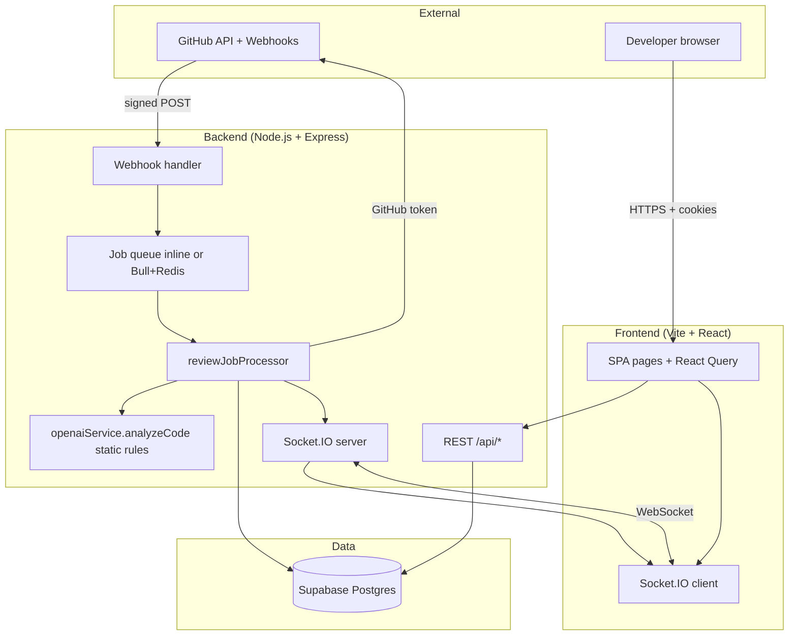
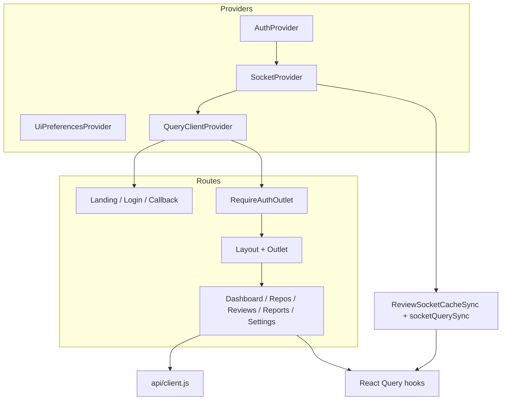
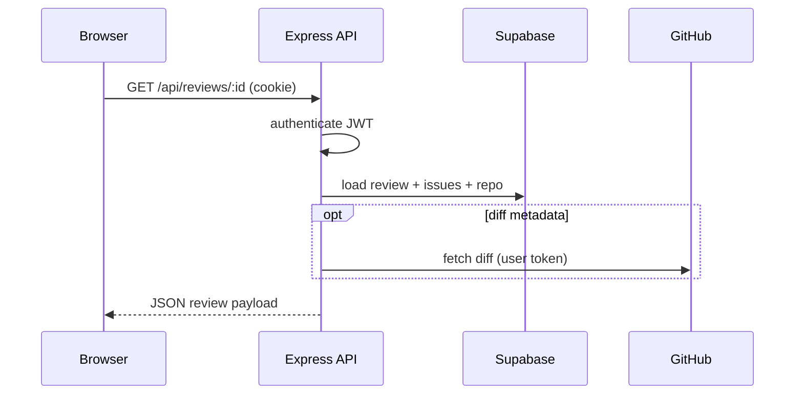
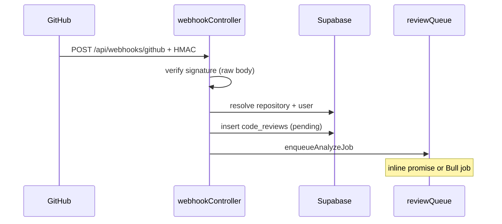
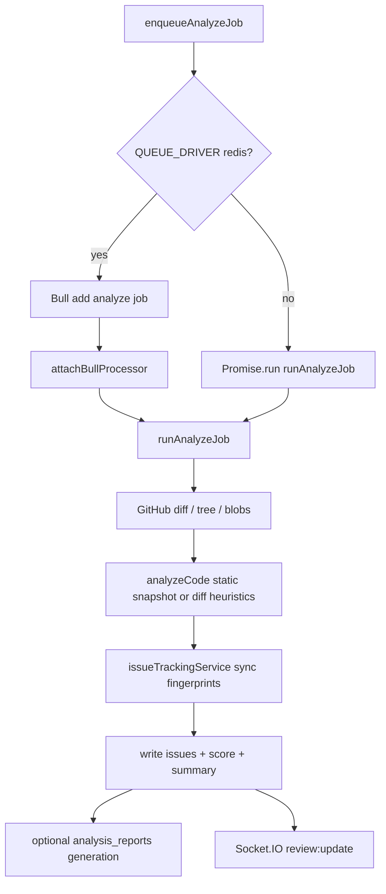
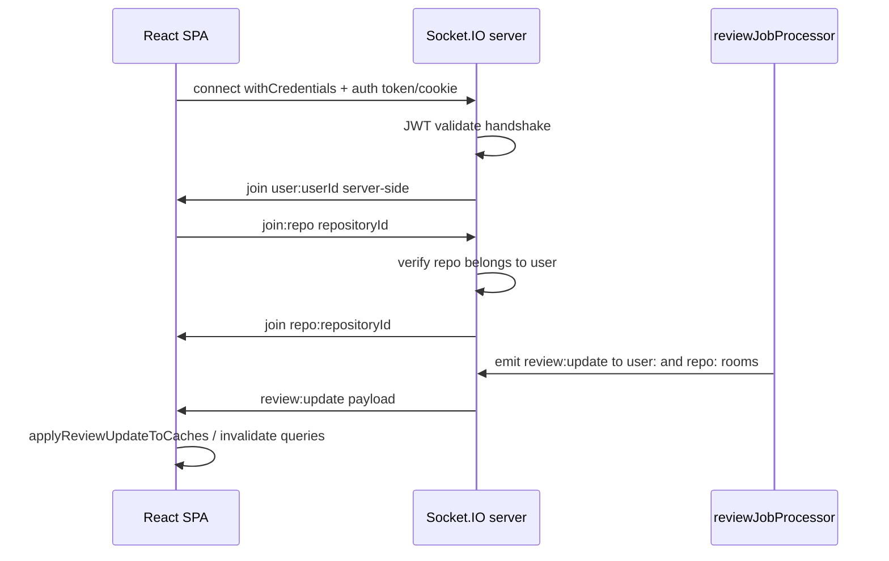

# System architecture

This document describes the **current** AI-Powered Code Review Assistant as implemented in this repository. It is written for thesis reviewers, evaluators, and maintainers.

**Analysis today:** deterministic **static rules** and **diff heuristics** via `openaiService.analyzeCode` — **no LLM HTTP API** is called (`getReviewAiRuntimeInfo().usesOpenAiApi === false`). See [Future AI Integration](FUTURE_AI_INTEGRATION.md) for how the design could evolve.

---

## Table of contents

1. [System overview](#1-system-overview)
2. [Component responsibilities](#2-component-responsibilities)
3. [Frontend architecture](#3-frontend-architecture)
4. [Backend architecture](#4-backend-architecture)
5. [Data flow](#5-data-flow)
6. [GitHub webhook flow](#6-github-webhook-flow)
7. [Review processing flow](#7-review-processing-flow)
8. [Socket.IO flow](#8-socketio-flow)
9. [Related documentation](#9-related-documentation)

---

## 1. System overview

The product is a **full-stack web application** that connects to a developer’s GitHub account, registers webhooks on selected repositories, and runs **automated code analysis** when commits are pushed (or when the user triggers a review manually). Results are stored in **Supabase (PostgreSQL)**, exposed through a **REST API**, and surfaced in a **React dashboard** with **real-time status** over Socket.IO.



### Deployment surfaces

| Surface | Technology | Role |
|---------|------------|------|
| **SPA** | React 18, Vite, Tailwind | Authenticated UI: dashboard, repos, reviews, reports, settings |
| **API** | Express 4, Node 20+ | Auth, CRUD, webhooks, job enqueue, health |
| **Realtime** | Socket.IO 4 | Push `review:update` to connected clients |
| **Persistence** | Supabase JS (service role) | Users, repos, reviews, issues, reports |
| **Queue (optional)** | Bull + Redis | Production-style async jobs when `QUEUE_DRIVER=redis` |

There is **no separate BFF**: the SPA talks directly to the API. Business logic for reviews lives in the **Node worker**, not in database triggers.

---

## 2. Component responsibilities

### Frontend

| Area | Location | Responsibility |
|------|----------|----------------|
| **Routing** | `App.jsx`, React Router 6 | Public landing/OAuth callback; lazy-loaded workspace routes behind `RequireAuthOutlet` |
| **Auth** | `AuthContext.jsx`, `LoginPage`, `CallbackPage` | Session via httpOnly `acr_session` cookie; GitHub OAuth handoff |
| **API client** | `api/client.js`, `api/schemas.js` | Axios + Zod contract checks for critical responses |
| **Server state** | TanStack Query, `lib/queryKeys.js` | Cached lists, dashboard bundle, invalidation on mutations |
| **Realtime cache** | `SocketContext`, `socketQuerySync.js`, `reviewCacheSync.js` | Patch/invalidate queries on `review:update` |
| **Features** | `features/*`, `pages/*` | Repos connection, review detail, reports, dashboard charts |
| **Shell** | `Layout.jsx`, `components/common/*` | Navigation, breadcrumbs, offline/reconnect banners |

### Backend

| Area | Location | Responsibility |
|------|----------|----------------|
| **HTTP entry** | `server.js` | Helmet, CORS, cookies, rate limits, route mounting, Socket.IO attach |
| **Auth** | `authController.js`, `middleware/auth.js` | GitHub OAuth, JWT cookie, `GET /api/auth/me` |
| **Repos** | `reposController.js`, `reposService.js` | Connect/disconnect, webhook install, GitHub picker |
| **Reviews** | `reviewsController.js`, `reviewJobProcessor.js` | List/detail, manual trigger, analyze pipeline |
| **Webhooks** | `webhookController.js` | HMAC verify, dedupe, enqueue analyze |
| **Reports** | `reportsController.js`, `reportGeneratorService.js` | Markdown reports, optional remediation confirm |
| **Analysis** | `openaiService.js`, `repositoryAnalyzer.js`, `staticRules.js` | Snapshot scan + diff fallback (**no OpenAI HTTP**) |
| **Issue tracking** | `issueTrackingService.js`, `issueFingerprint.js` | Cross-run OPEN/RESOLVED issues, score from active findings |
| **Queue** | `reviewQueue.js`, `queueWorker.js`, `queueConfig.js` | Inline vs Redis driver |
| **Sockets** | `registerSocketIO.js` | JWT handshake, `user:{id}` and `repo:{id}` rooms |
| **Tokens** | `userTokenService.js` | Encrypt/decrypt GitHub tokens at rest |

### External systems

| System | Interaction |
|--------|-------------|
| **GitHub OAuth** | User login; scopes include `repo`, `admin:repo_hook` |
| **GitHub REST** | Diffs, trees, blobs, webhooks, optional remediation push |
| **Supabase** | All app persistence via service-role client |
| **Redis (optional)** | Bull queue backend only |

---

## 3. Frontend architecture



### Key design choices

- **Functional React** with hooks; route-based code splitting (`React.lazy` + `Suspense`).
- **Credentialed HTTP**: `axios` defaults `withCredentials: true` so the session cookie reaches `/api/*`.
- **Vite dev proxy**: `/api` proxied to `localhost:3001`; production uses same-origin or configured API base.
- **No global Redux**: TanStack Query owns server state; socket handlers patch cache for snappy UI.
- **Styling**: Tailwind utility classes; shared primitives under `components/common/ui/`.

### Primary data reads

| UI area | Query / endpoint |
|---------|------------------|
| Dashboard | `GET /api/reviews/dashboard` (stats + recent reviews bundle) |
| Repos | `GET /api/repos` |
| Reviews list | `GET /api/reviews` |
| Review detail | `GET /api/reviews/:id` |
| Reports | `GET /api/reports`, markdown sub-resource |

---

## 4. Backend architecture

```mermaid
flowchart LR
  subgraph HTTP
    R_AUTH[/api/auth]
    R_REPO[/api/repos]
    R_REV[/api/reviews]
    R_REP[/api/reports]
    R_WH[/api/webhooks]
  end

  subgraph Services
    S_AUTH[auth + userToken]
    S_REPO[repos + githubWebhook]
    S_JOB[reviewQueue + reviewJobProcessor]
    S_ANA[openaiService → repositoryAnalyzer / localAnalysisEngine]
    S_REP[reportGenerator + issueTracking]
  end

  subgraph Infra
    DB[(Supabase)]
    GH[GitHub API]
  end

  R_AUTH --> S_AUTH --> DB
  R_REPO --> S_REPO --> DB
  R_REPO --> GH
  R_REV --> S_JOB
  R_WH --> S_JOB
  S_JOB --> S_ANA --> GH
  S_JOB --> S_REP --> DB
  R_REP --> S_REP
```

### Layering convention

1. **Routes** — Express routers, validation (`express-validator`), `authenticate` middleware where required.
2. **Controllers** — HTTP status codes, `AppError`, thin orchestration.
3. **Services** — Business rules, GitHub calls, analysis, queues.
4. **Repositories** — Supabase queries (`*Repository.js` modules).

### Security middleware (summary)

- **Global** `rateLimiter` on all routes (webhooks/health skipped).
- **`authLimiter`** on OAuth and logout only (`routes/auth.js`).
- **Webhook** raw body + `X-Hub-Signature-256` verification.
- **Production env validation** at boot (`validateProductionEnv.js`).

---

## 5. Data flow

### Authenticated read path (example: review detail)



### Write path (example: connect repository)

1. User selects repo in SPA → `POST /api/repos/connect`.
2. Backend stores row in `repositories`, installs GitHub webhook using `BACKEND_URL`.
3. SPA invalidates `repos` and dashboard queries.

### Persistence model (conceptual)

| Entity | Purpose |
|--------|---------|
| `users` | GitHub identity, encrypted token |
| `repositories` | Connected repo + webhook metadata |
| `code_reviews` | One analysis run (status, score, branch, SHA) |
| `review_issues` | Findings for a run (with lifecycle + fingerprint) |
| `repository_issues` | Cross-run tracked issues per repo |
| `analysis_reports` | Generated markdown + remediation metadata |

Full DDL: `backend/src/config/schema.sql`.

---

## 6. GitHub webhook flow

When a push (or configured event) hits a connected repository, GitHub delivers a **signed** payload to the backend.

**Detailed diagram:** [diagrams/webhook_flow.md](diagrams/webhook_flow.md)



**Important behaviours**

- `express.raw` applies **only** under `/api/webhooks` so the HMAC input matches GitHub’s bytes.
- Duplicate commits may be deduplicated before insert (see `webhookController.js`).
- Invalid signature → **401**; unknown repo → ignored or errored per handler logic.

---

## 7. Review processing flow

**Detailed diagram:** [diagrams/queue_processing.md](diagrams/queue_processing.md)



### Analysis modes (current)

| Mode | When | Engine |
|------|------|--------|
| **Snapshot** | `repoFullName`, `userId`, `commitSha` available | Walk Git tree at SHA, run `staticRules` on `.js/.ts/.vue` under `src/` |
| **Diff fallback** | Snapshot fails or incomplete | `localAnalysisEngine` + `diffHeuristicAudit` on unified diff text |

### Manual triggers

- User **“Review latest”** on Repos → `POST /api/reviews/trigger-latest`.
- Retry failed/pending → `POST /api/reviews/retry/:id`.

Same `runAnalyzeJob` path as webhooks after enqueue.

---

## 8. Socket.IO flow

**Detailed diagram:** [diagrams/socket_io_flow.md](diagrams/socket_io_flow.md)



### Event payload (conceptual)

`review:update` includes at least `reviewId`, `status`, and optionally `overallScore` after completion.

### Client resilience

- Reconnection with backoff (`SocketContext.jsx`).
- `RealtimeUpdatesBanner` when socket is down but HTTP still works.
- Dashboard **polling** interval as backup if an event is missed.

### Multi-instance note

A single Node process is assumed for the thesis deployment. Horizontal scale would require a **Redis adapter** for Socket.IO so emits reach all instances.

---

## 9. Related documentation

| Document | Topic |
|----------|--------|
| [FUTURE_AI_INTEGRATION.md](FUTURE_AI_INTEGRATION.md) | Planned LLM path — **not** current behaviour |
| [diagrams/oauth_flow.md](diagrams/oauth_flow.md) | GitHub OAuth sequence |
| [diagrams/webhook_flow.md](diagrams/webhook_flow.md) | Webhook → queue |
| [diagrams/queue_processing.md](diagrams/queue_processing.md) | Worker / queue driver |
| [diagrams/socket_io_flow.md](diagrams/socket_io_flow.md) | Realtime channel |
| [diagrams/system_context.md](diagrams/system_context.md) | C4-style context diagram |
| [DEVELOPMENT.md](DEVELOPMENT.md) | Local setup, CORS |
| [THREAT_MODEL.md](THREAT_MODEL.md) | Security threats and mitigations |
| [../README.md](../README.md) | Full project specification |

---

*This file is documentation only; it does not change application behaviour.*
