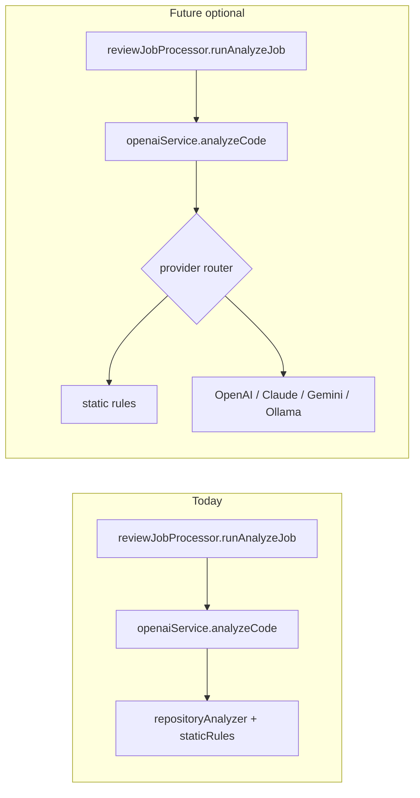

# Future AI Integration

This section documents **planned evolution** of the analysis pipeline. It is **not** a description of what runs in production today.

---

## What runs today (be explicit)

| Claim | Fact in this repository |
|-------|-------------------------|
| “AI-powered review” in the product name | Marketing/thesis framing for an **automated** reviewer |
| OpenAI / GPT API calls during review | **No** — `getReviewAiRuntimeInfo()` returns `usesOpenAiApi: false` |
| Claude, Gemini, or Ollama | **Not integrated** |
| Analysis engine | **Deterministic static analysis**: rule engine on repository snapshots (`staticRules.js`, `repositoryAnalyzer.js`) plus **diff-only heuristics** when snapshot scan is unavailable (`localAnalysisEngine.js`, `diffHeuristicAudit.js`) |
| Entry point name | `openaiService.js` is a **legacy module name** kept for stable imports; it routes to local analysis only |

Evaluators should treat current scores and findings as outputs of **rule-based** inspection, not generative model reasoning.

---

## Why the current build uses static analysis only

The implementation deliberately optimises for:

1. **Zero marginal API cost** — no per-commit charges from cloud LLM providers; suitable for a student/thesis budget and repeatable demos.
2. **Reproducibility** — same commit SHA yields the same rule hits (modulo GitHub tree truncation documented in `analysisScanCompleteness.js`).
3. **Latency predictability** — no network round-trip to an LLM; bounded by GitHub API + local CPU.
4. **Privacy** — source code for analysis is fetched via the user’s GitHub token and processed on the **self-hosted backend**; no third-party model vendor receives repo content in the default path.
5. **Thesis defensibility** — measurable rules, fingerprints, and an offline `evaluation/` harness support academic evaluation without non-deterministic model drift.

These were **engineering tradeoffs**, not a claim that static analysis replaces human or LLM review in all cases.

---

## How the architecture already supports future LLM integration

The codebase separates concerns so a model provider can be swapped **behind the same job boundary** without redesigning the UI or database schema.

### Extension points (existing code)

| Layer | Role in a future LLM path |
|-------|---------------------------|
| **`reviewJobProcessor.js`** | Unchanged orchestration: fetch diff/tree, persist results, emit `review:update`, sync `issueTrackingService` |
| **`openaiService.analyzeCode`** | Natural **facade**: today branches snapshot vs diff static; tomorrow could call a provider when `usesOpenAiApi` (or new env flags) is true |
| **`review_issues` + fingerprints** | LLM suggestions could still be normalised into the same issue shape for dashboard and cross-run tracking |
| **`reportGeneratorService.js`** | Markdown reports could incorporate model narrative **in addition to** rule findings |
| **Queue (`reviewQueue.js`)** | Same Bull/inline queue; LLM calls stay **async** inside the worker to avoid blocking HTTP |
| **Frontend** | No change required for a first integration if API response shapes stay stable |

### Provider options (not implemented)

Future versions **could** integrate one or more of:

| Provider | Typical use |
|----------|-------------|
| **OpenAI** | Chat/completions API with structured JSON output for findings |
| **Anthropic Claude** | Long-context review of diffs or files |
| **Google Gemini** | Alternative hosted API |
| **Ollama** (local) | On-prem or lab machine — aligns with privacy-sensitive deployments |

Configuration would likely add API keys and feature flags **only on the server** (never `VITE_*`), mirroring existing GitHub and Supabase secrets.

### Suggested integration pattern (design note)

A academically honest rollout would:

1. Keep **static rules as baseline** (fast, free, deterministic).
2. Optionally run an **LLM second pass** on capped input (diff hunks or top-N files) when enabled.
3. Merge or de-duplicate issues before `issueTrackingService` sync.
4. Record in report metadata which engine produced each finding (provenance for thesis evaluation).

None of the above is wired in the current branch unless explicitly added in a future release.

---

## What would need to change (checklist for maintainers)

When implementing LLM support, expect to touch **documentation and configuration**, not necessarily the SPA:

- Environment variables for provider keys and model IDs.
- `getReviewAiRuntimeInfo()` to reflect real API usage.
- Rate limiting / cost caps per user or per repo.
- Timeouts and retries in the worker (LLM latency >> static scan).
- Threat model updates (prompt injection via malicious repo content).
- Evaluation harness: separate metrics for LLM vs static runs.

**Remediation** (`remediationService.js`) is unrelated to LLM analysis; it applies rule-based file patches and is gated separately by `ENABLE_AUTO_REMEDIATION`.

---

## Academic transparency statement

For thesis or examiner readers:

- **Implemented:** GitHub-integrated static analysis platform with persistence, realtime UI, issue lifecycle, and optional auto-remediation (opt-in).
- **Described in README §6 but not executed in the default worker path:** LLM-style prompt engineering as a **design reference** for how a generative reviewer *could* be structured.
- **Future work:** Hosted or local LLM behind `analyzeCode`, preserving queue, schema, and API contracts.

Do not cite “GPT-4 reviews the codebase in this deployment” unless the runtime flag and provider integration have been explicitly enabled and demonstrated.

---

## Related reading

- [ARCHITECTURE.md](ARCHITECTURE.md) — current system flows
- [../README.md](../README.md) §6 — prompt engineering (comparative / educational)
- `backend/src/services/openaiService.js` — current `analyzeCode` implementation
- `evaluation/README.md` — offline static analyzer benchmark

---

*Documentation only — no application code is modified by this file.*
