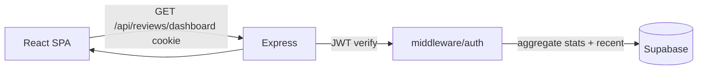
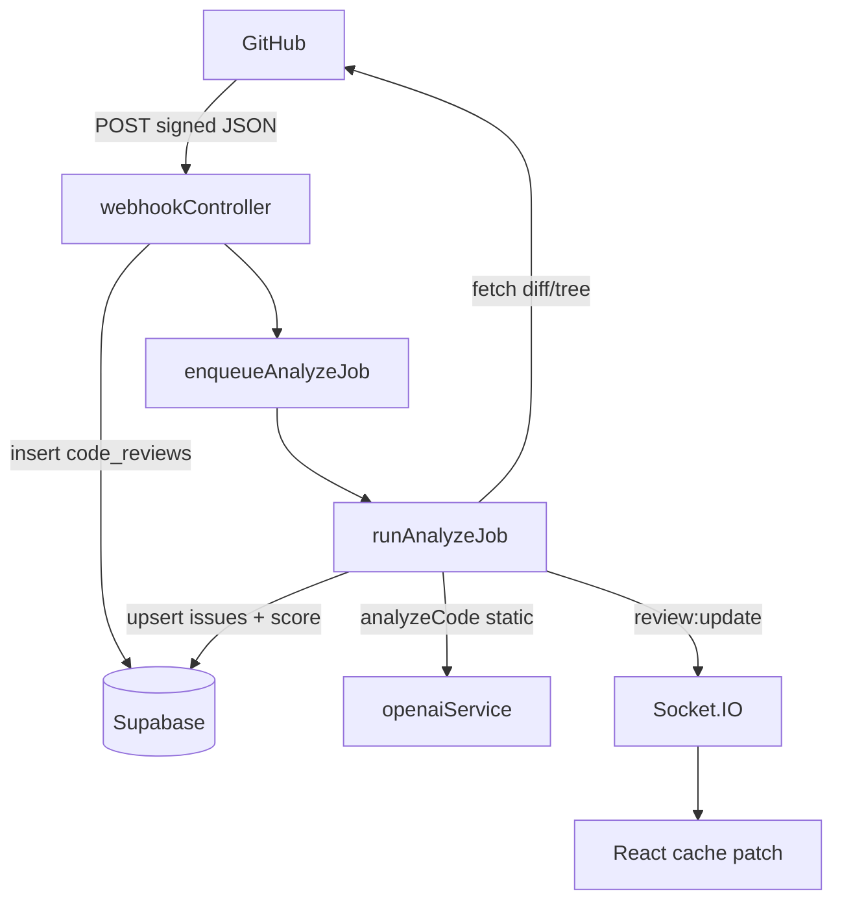
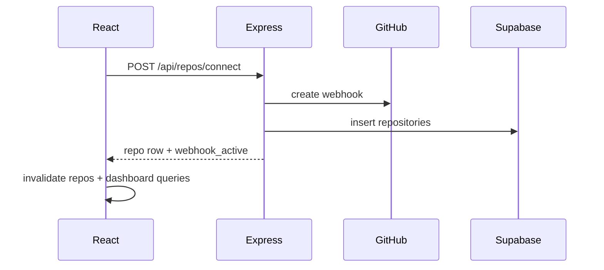

# Diagram: Data flow (logical)

How information moves between the browser, API, database, and GitHub for the main workflows.

See [ARCHITECTURE.md](../ARCHITECTURE.md) for narrative detail.

## Pull: authenticated dashboard load

## Push: GitHub webhook → persisted review

## Push: user connects repository

## Reports (derived artifact)

After a review completes, `reportGeneratorService` may write `analysis_reports` and markdown on disk. The SPA reads metadata via `GET /api/reports` and content via `GET /api/reports/:id/markdown`.

**Code references:** `reviewsController.js`, `webhookController.js`, `reviewJobProcessor.js`, `reportGeneratorService.js`, `frontend/src/api/client.js`.

*Documentation only.*
