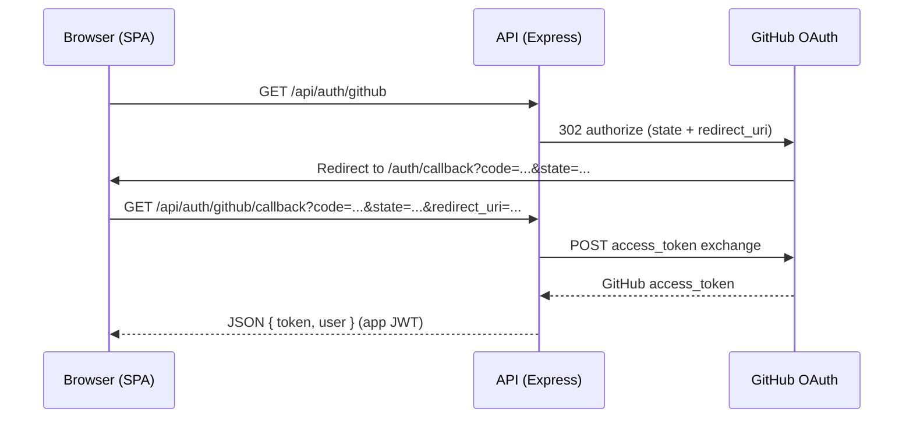

# Diagram: GitHub OAuth (browser login)

**Primary path:** the SPA sends the browser to **`GET {API}/api/auth/github`**, which redirects to GitHub with **`client_id`**, **`redirect_uri`**, **`scope`**, and a signed **`state`** (CSRF mitigation). GitHub returns to **`{SPA}/auth/callback?code=…&state=…`**. The SPA exchanges the code via **`GET /api/auth/github/callback`** with the same **`state`**, **`code`**, and **`redirect_uri`** (see `frontend/src/api/client.js`).

Textual flow (happy path):

1. User clicks login on the SPA → browser goes to **`{API}/api/auth/github`** → **302** to **`https://github.com/login/oauth/authorize?...&state=...`** (`LoginPage.jsx`).
2. GitHub redirects to **`{SPA}/auth/callback?code=…&state=…`**.
3. **`CallbackPage.jsx`** calls **`authApi.githubCallback(code, state)`** → **`GET /api/auth/github/callback`** with `redirect_uri` matching the SPA callback URL.
4. Backend verifies **`state`**, exchanges the code with GitHub, upserts the user, returns **JSON** with app **JWT** + user profile (`authController.js`).
5. SPA stores JWT and continues in-app.

**Alternate route (legacy / not used by `LoginPage.jsx` today):** building the GitHub authorize URL entirely in the browser with `VITE_GITHUB_CLIENT_ID` **without** `state` is no longer the primary flow.

**Code references:** `frontend/src/pages/LoginPage.jsx`, `frontend/src/pages/CallbackPage.jsx`, `frontend/src/api/client.js`, `backend/src/utils/githubOAuthState.js`, `backend/src/controllers/authController.js`, `backend/src/routes/auth.js`.

This file is **documentation only**; it does not alter OAuth behaviour.
