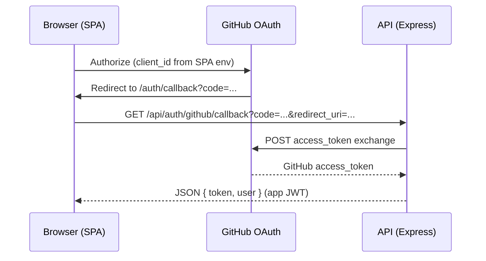

# Diagram: GitHub OAuth (browser login)

**Primary path in this codebase (SPA-initiated):** the React app builds the GitHub authorize URL with `VITE_GITHUB_CLIENT_ID` and `redirect_uri = <SPA>/auth/callback`, then GitHub returns the browser to the SPA with `?code=…`. The SPA exchanges the code via **`GET /api/auth/github/callback`** (see `frontend/src/api/client.js`).

Textual flow (happy path):

1. User clicks login on the SPA → browser goes to **`https://github.com/login/oauth/authorize?...`** (`LoginPage.jsx`).
2. GitHub redirects to **`{SPA}/auth/callback?code=…`**.
3. **`CallbackPage.jsx`** calls **`authApi.githubCallback(code)`** → **`GET /api/auth/github/callback`** with `redirect_uri` matching the SPA callback URL.
4. Backend exchanges the code with GitHub, upserts the user, returns **JSON** with app **JWT** + user profile (`authController.js`).
5. SPA stores JWT and continues in-app.

**Alternate route (server-initiated):** `GET /api/auth/github` redirects to GitHub using server-side `GITHUB_CLIENT_ID` — useful if you ever drop client-side OAuth construction; it is **not** what `LoginPage.jsx` uses today.

**Code references:** `frontend/src/pages/LoginPage.jsx`, `frontend/src/pages/CallbackPage.jsx`, `frontend/src/api/client.js`, `backend/src/controllers/authController.js`, `backend/src/routes/auth.js`.

This file is **documentation only**; it does not alter OAuth behaviour.
