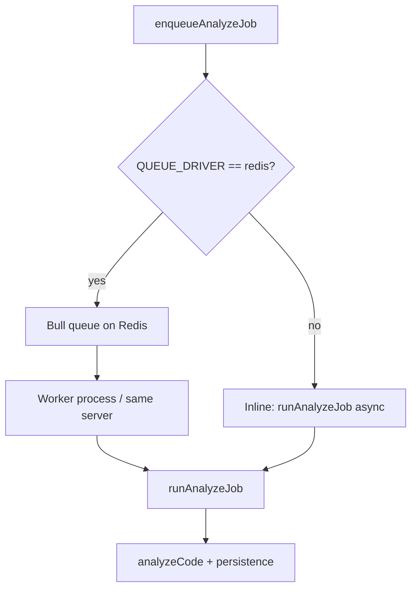

# Diagram: Review job processing (queue / worker)

Part of [ARCHITECTURE.md](../ARCHITECTURE.md) §7. Related: [webhook_flow.md](webhook_flow.md), [socket_io_flow.md](socket_io_flow.md).

Textual overview:

1. **Enqueue:** `enqueueAnalyzeJob({ reviewId, repositoryId, userId, ... })` is called from webhook or manual review routes.
2. **Driver selection:** If `QUEUE_DRIVER !== 'redis'`, the job runs **in-process** immediately (`reviewQueue.js` → `runAnalyzeJob` in a detached promise). If `QUEUE_DRIVER === 'redis'`, Bull persists the job to **Redis** and workers consume it (`queueWorker.js` → `attachBullProcessor`).
3. **Processing:** `runAnalyzeJob` loads repo metadata, fetches diff via GitHub when possible, calls **`openaiService.analyzeCode`** (snapshot + static rules when credentials + SHA exist; else diff heuristics — **no OpenAI HTTP** in default config), writes results, optional PR comments, emits realtime updates.

**Code references:** `backend/src/services/reviewQueue.js`, `backend/src/services/queueWorker.js`, `backend/src/services/queueConfig.js`, `backend/src/services/reviewJobProcessor.js`, `backend/src/services/openaiService.js`.

This file is **documentation only**; it does not change queue configuration or concurrency.
