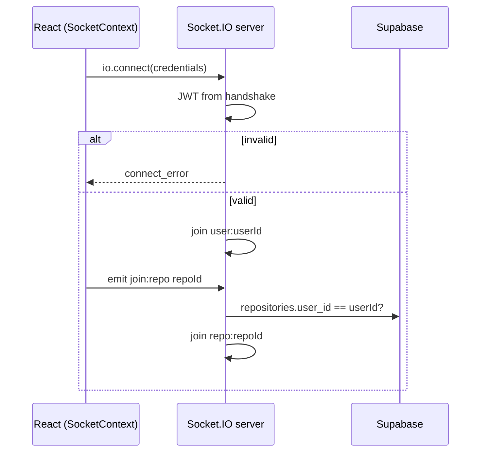
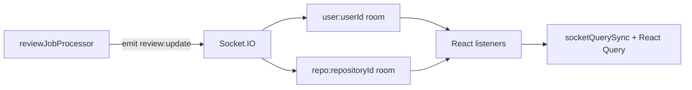

# Diagram: Socket.IO realtime flow

The SPA uses Socket.IO for **review lifecycle** updates only. It is not a general-purpose message bus.

## Connection and rooms

1. After login, `SocketProvider` connects to the API origin (or `VITE_WS_URL` when split) with **`withCredentials: true`**.
2. Server middleware (`registerSocketIO.js`) validates the session JWT from handshake `auth.token` or cookies.
3. On success, the server joins the socket to **`user:{userId}`** automatically.
4. The client may emit **`join:repo`** with a repository UUID; the server verifies ownership before joining **`repo:{repositoryId}`**.



## Review status events

When `runAnalyzeJob` updates a review (pending → processing → completed/failed), the worker emits:

```text
review:update  →  rooms: user:{userId}, repo:{repositoryId}
```

Payload fields used by the UI include `reviewId`, `status`, and optionally `overallScore`.



## Client handling

| Component | Behaviour |
|-----------|-----------|
| `SocketContext.jsx` | Subscribes to `review:update`, fans out to registered listeners |
| `ReviewSocketCacheSync.jsx` | Calls `applyReviewUpdateToCaches` on each event |
| `socketQuerySync.js` | Patches dashboard/review list caches; debounced refetch on terminal states |
| `DashboardPage.jsx` | Also invalidates bundle on events; polling fallback |

## Degraded mode

If the socket is disconnected, `RealtimeUpdatesBanner` informs the user. Lists and detail pages still work via **REST** and periodic **refetchInterval** on the dashboard.

## Scale-out note

Multiple API instances require a **Redis Socket.IO adapter** so emits reach clients on other nodes. Single-node thesis deployments do not need this.

**Code references:** `backend/src/socket/registerSocketIO.js`, `backend/src/services/reviewJobProcessor.js`, `frontend/src/context/SocketContext.jsx`, `frontend/src/lib/socketQuerySync.js`.

*Documentation only.*
