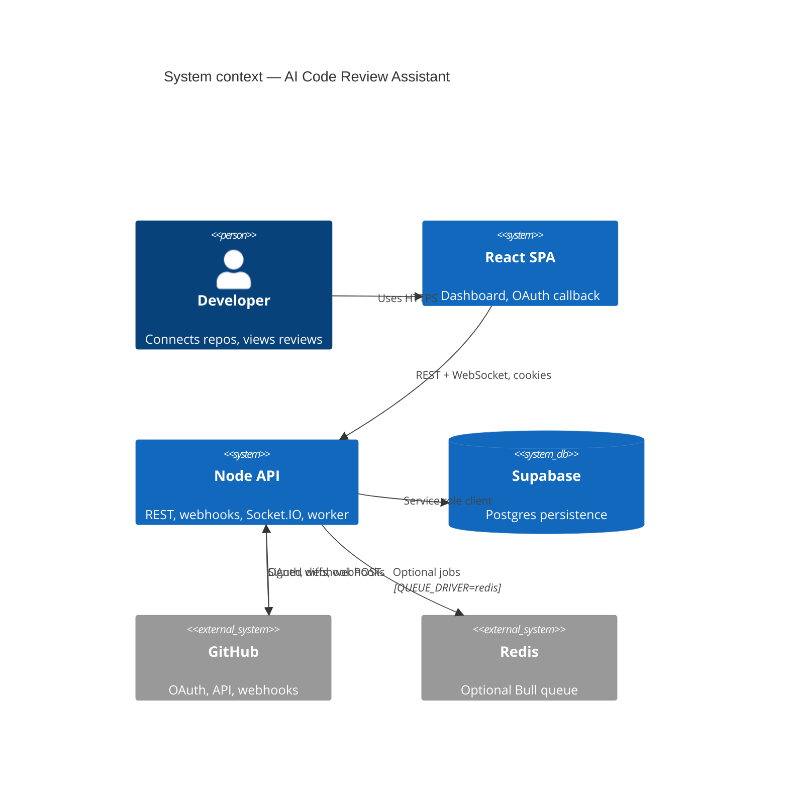

# Diagram: System context (C4 level 1)

High-level view of actors and software boundaries for the AI-Powered Code Review Assistant.

## Trust boundaries

| Boundary | Notes |
|----------|--------|
| Browser ↔ API | Session cookie `acr_session`; CORS allow-list via `FRONTEND_URL` |
| API ↔ Supabase | Service role key — **bypasses RLS**; all authorization in application code |
| API ↔ GitHub | Per-user encrypted token; webhook HMAC with `GITHUB_WEBHOOK_SECRET` |
| Analysis | Runs on API host CPU — static rules today; see [FUTURE_AI_INTEGRATION.md](../FUTURE_AI_INTEGRATION.md) for LLM |

*Documentation only.*
